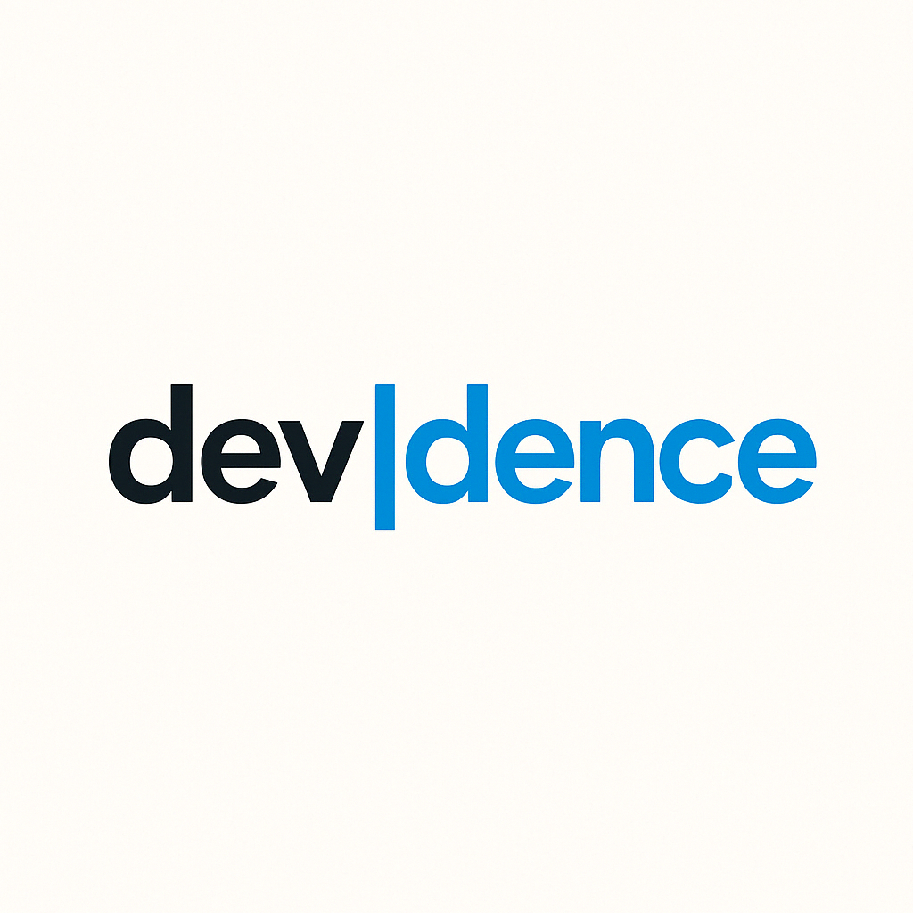

# Devidence Home Landing Page

An elegant landing page inspired by the Galaxy theme from LinkStack, developed with Svelte and Vite. This page features a minimalist interface with an animated starry background, ideal for showcasing personal or professional links.



## 🌟 Features

- Modern design inspired by the Galaxy theme from LinkStack
- Animated starry background
- Central profile with photo and verification
- Custom social media buttons
- Fully responsive
- Parallax background effect
- Footer links

## 🛠️ Technologies Used

- [Svelte](https://svelte.dev/) - Framework for building user interfaces
- [Vite](https://vitejs.dev/) - Frontend development tool
- Custom CSS for animations and styles
- Docker for production deployment

## 💻 Prerequisites

- [Node.js](https://nodejs.org/) (v18 or higher)
- [npm](https://www.npmjs.com/) or [yarn](https://yarnpkg.com/)
- [Docker](https://www.docker.com/) and [Docker Compose](https://docs.docker.com/compose/) (for deployment)

## 🚀 Installation and Usage

### Local Development

1. Clone this repository
   ```bash
   git clone https://github.com/devidence-dev/devidence-home.git
   cd devidence-home
   ```

2. Install dependencies
   ```bash
   npm install
   ```

3. Start the development server
   ```bash
   npm run dev
   ```

4. Open your browser at [http://localhost:5173](http://localhost:5173)

### Build for Production

```bash
npm run build
```

The generated files will be in the `dist` directory.

## 🐳 Deployment with Docker

The project includes Docker configuration with security hardening measures.

1. Build and run with Docker Compose:
   ```bash
   docker-compose up -d
   ```

2. Access the application at [http://localhost:8080](http://localhost:8080)

### Security Features

- Multi-stage build to reduce final image size
- Run as a non-privileged user
- Read-only file system
- Hardened Nginx configuration
- Container with limited capabilities
- Configured HTTP security headers

## 🎨 Customization

To customize the page:

1. Modify the texts and links in `src/lib/Profile.svelte`
2. Change the logo in `public/images/`
3. Adjust colors and styles in `src/app.css` and CSS files in `src/assets/styles/`
4. Configure social buttons in `src/lib/SocialButton.svelte`

## 🔒 Security

This project implements multiple layers of security:

- HTTP security headers (CSP, X-Frame-Options, etc.)
- Hardened Docker container
- Run as a non-privileged user
- Principle of least privilege applied

## License 🔒

Pablo Pin - devidence.dev ©

## 🙏 Acknowledgments

- Inspired by the [Galaxy](https://github.com/LinkStackOrg/LinkStack/tree/main/themes/galaxy) theme from LinkStack
- devidence.dev ©
